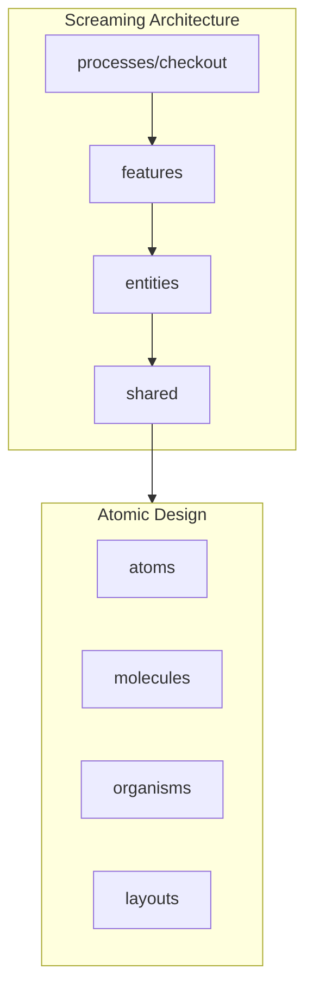
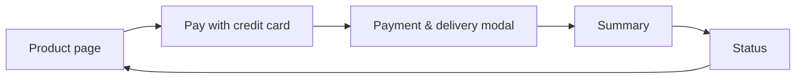
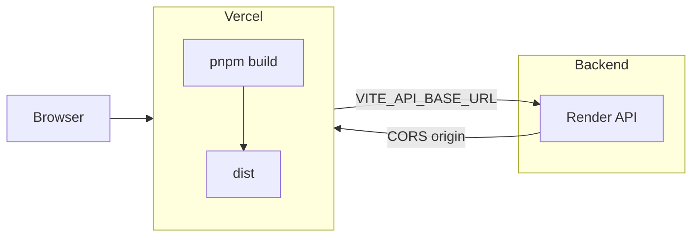

# Frontend - FullStack TT

SPA built with **React + Vite + TypeScript** and **Redux Toolkit** for a 5-step checkout flow, integrated with the backend API (see [backend README](../backend/README.md) for API and deployment).

## Stack

- React 19
- Vite 7
- TypeScript
- Redux Toolkit + React Redux
- React Router
- Tailwind CSS
- shadcn/ui + Radix UI
- next-themes (light/dark adaptive)
- React Hook Form + Zod + @hookform/resolvers
- Vitest

## Architecture

Two complementary approaches are used:

- **Screaming Architecture** for domain/flow organization:
  - `src/processes/checkout`
  - `src/features/*`
  - `src/entities/*`
  - `src/shared/*`
- **Atomic Design** for reusable UI:
  - `src/shared/ui/atoms`
  - `src/shared/ui/molecules`
  - `src/shared/ui/organisms`
  - `src/shared/ui/layouts`
- Global `ThemeProvider` with persisted toggle for an adaptable experience.

## User Flow

1. **Product** (`/product`)
2. **Pay with credit card** button on product page
3. **Modal/backdrop** for payment and delivery data
4. **Summary** (`/summary`) and payment
5. **Status** (`/status`) then return to product with updated stock

Optional: “Fill test data” for manual testing; resilience via refresh recovery (reference, idempotency).

## Local Development

Backend expected at `http://localhost:3000/api/v1`.

1. Copy `.env.example` to `.env`
2. Set `VITE_API_BASE_URL=http://localhost:3000/api/v1`
3. Run the backend locally (see backend README)

## Deployment and Integration

The frontend is deployed on **Vercel**; the backend runs on **Render**. The SPA uses rewrites so all routes serve `index.html`. CORS on the backend must allow the frontend origin.

### Deploy on Vercel

1. Import this repository in [Vercel](https://vercel.com) and create a new project.
2. **Build Command:** `pnpm build` (or use root `vercel.json`).
3. **Output Directory:** `dist` (Vite default).
4. Add **Environment Variable:** `VITE_API_BASE_URL` = your backend API base URL (e.g. `https://your-app.onrender.com/api/v1`). Required so the frontend calls the deployed backend; ensure backend CORS allows your Vercel origin.
5. Deploy; Vercel runs `pnpm install` and `pnpm build`.

## Security and Persistence

- Only a **safe draft** of the checkout is stored in `localStorage`: `productId`, `quantity`, `customer`, `delivery`, `reference`, `idempotencyKey`.
- **PAN/CVV are not persisted.** Card data lives only in volatile application state.

## Scripts

- `pnpm dev` — Development server
- `pnpm lint` — Lint and fix
- `pnpm build` — Production build
- `pnpm test` — Unit tests
- `pnpm test:cov` — Coverage (global threshold 80%)

## Compliance and Integration Checklist

- **SPA** in React + Redux Toolkit: done.
- **5-step flow**: Product → Pay → Modal → Summary → Status: done.
- **Literal “Pay with credit card”** button: done on Product page.
- **Modal/backdrop** for card and delivery: done in PaymentDeliveryModal.
- **Modern, professional UI**: Tailwind + shadcn and adaptive theme: done.
- **Resilience on refresh**: recovery via `reference` and `idempotencyKey`: done.
- **Sensitive data**: no PAN/CVV persistence: done.
- **API integrations**: `GET /products`, `POST /checkout/preview`, `POST /transactions` (idempotency), `POST /transactions/:reference/pay`, `GET /transactions/:reference`: done.
- **Error handling**: 400/404/429/5xx mapped to user-facing messages: done.

## Test Coverage

- `pnpm test:cov` meets the **80%** global threshold.
- Current figures: statements, branches, functions, and lines as reported by Vitest.
